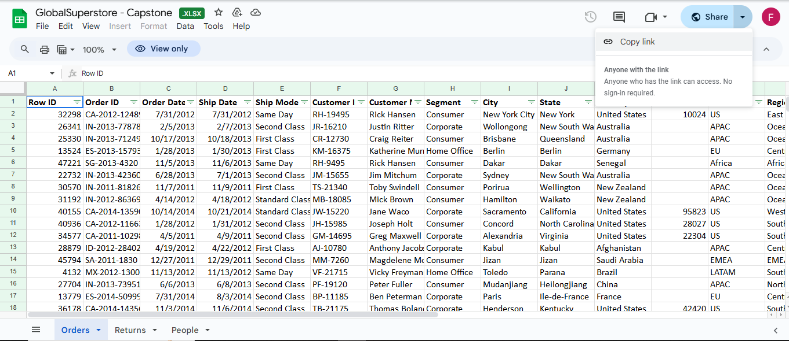
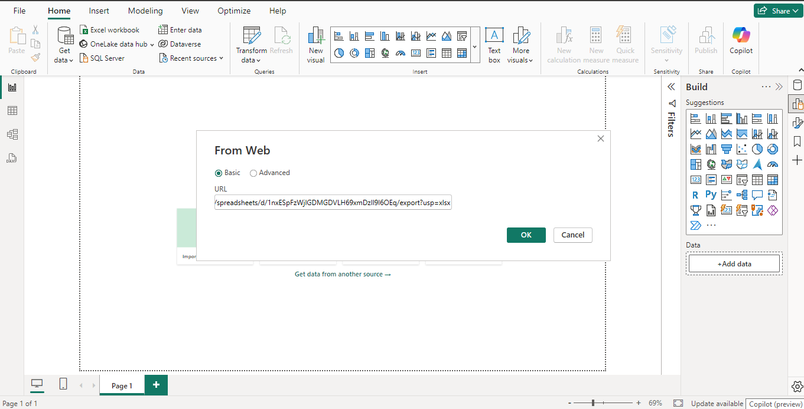
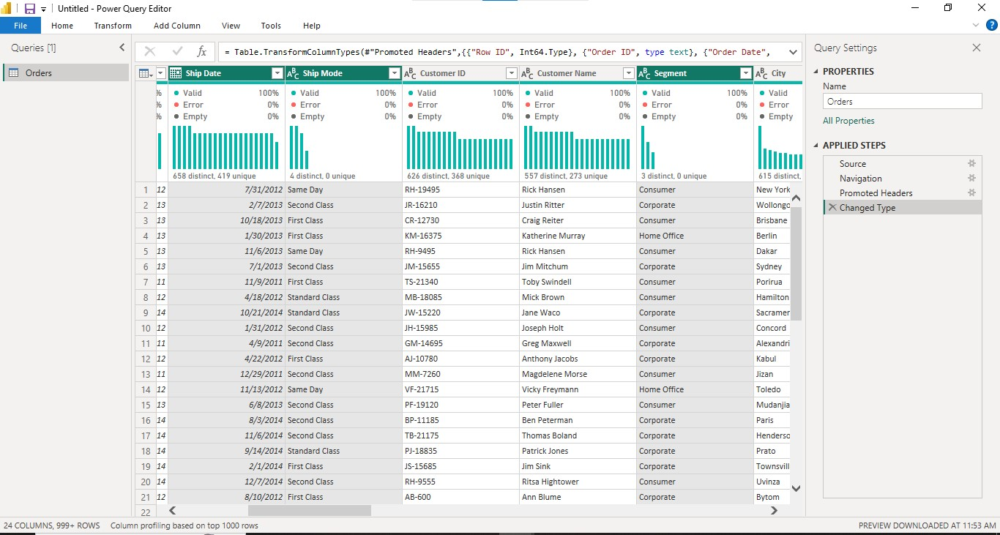
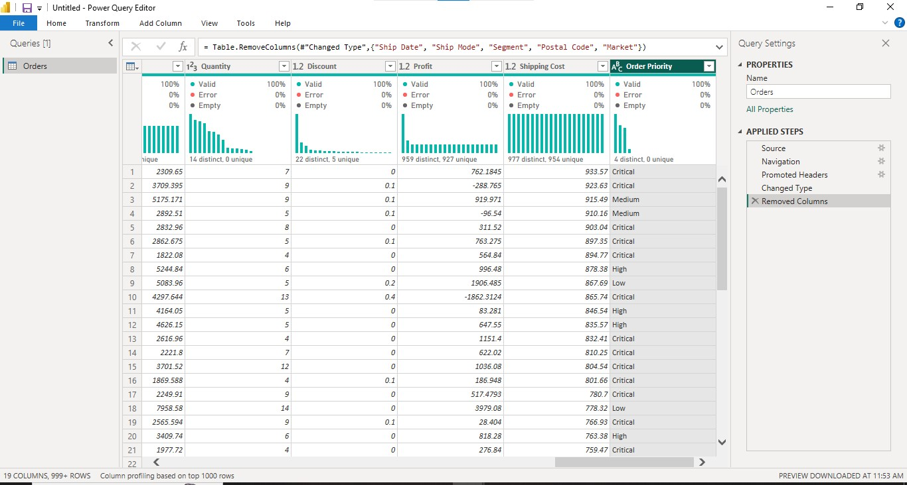
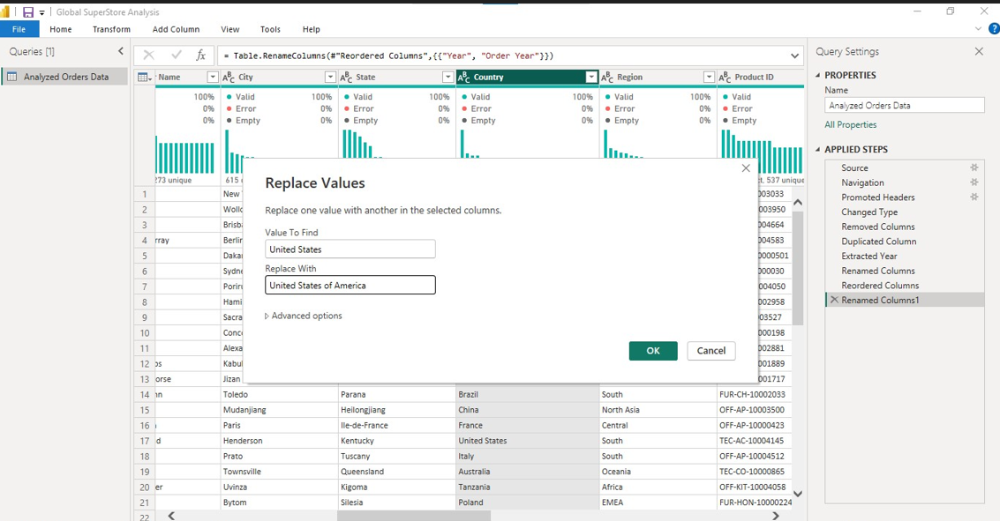
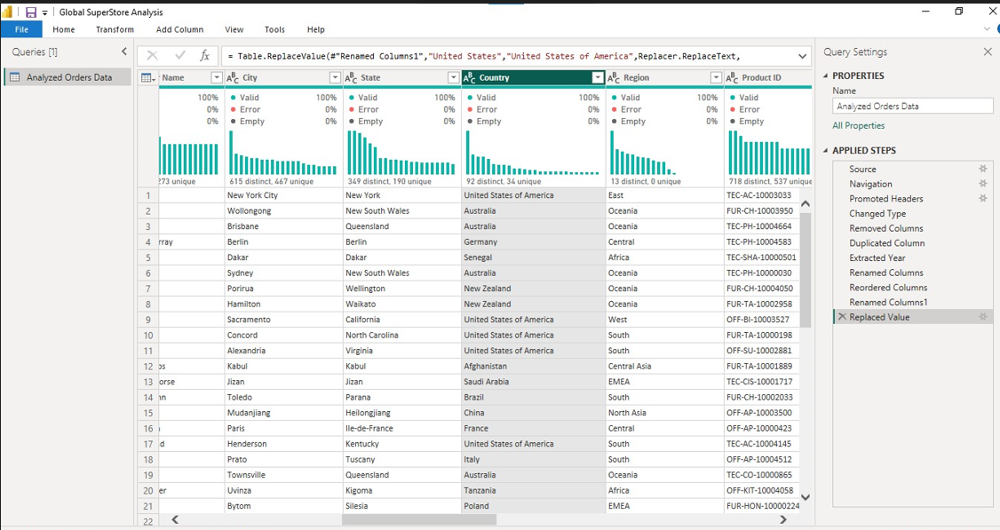
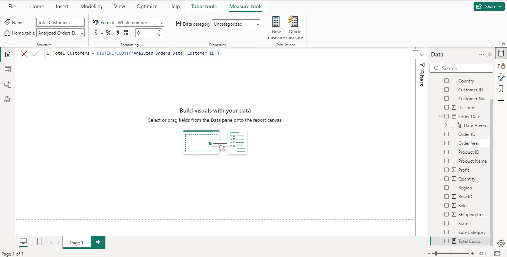
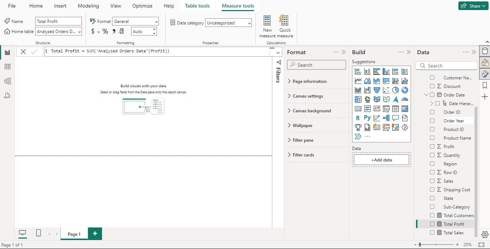
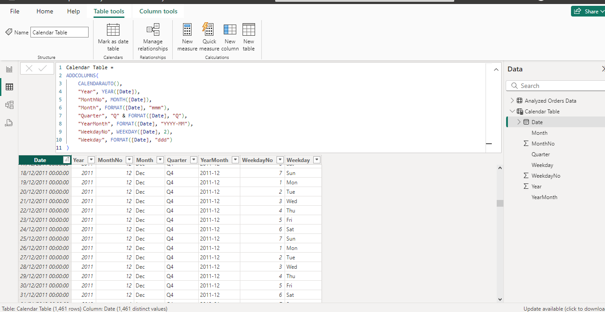
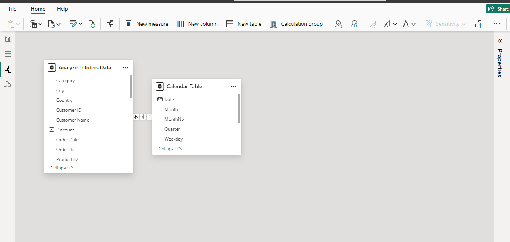

# Global Superstore Report

## Introduction:
This Power BI project represents the final milestone in my Digitaley Drive program. It explores product and profit performance for the fictional “Global Superstore,” an online retailer based in New York, USA. Global Superstore serves 147 countries with a diverse product catalog across three categories: Office Supplies, Furniture, and Technology.

_Disclaimer_: _The dataset is entirely fictional and bears no intentional resemblance to real-world entities._

## Skills/Concept Demonstrated:
Key Power Bi features utilized include:

•	DAX,

•	Measures,

•	Tooltips,

•	Data Modelling,

•	Page Navigation,

•	Filters,

•	Interactive Buttons

## Business Objective: 
To optimize performance and improve profitability.

## Problem Statement:
1a: What are the three countries that generated the highest total profit for Global Superstore in 2014?

 b: For each of these three countries, find the three products with the highest total profit. Specifically, what are the products’ names and the total profit for each product?

2: Identify the 3 subcategories with the highest average shipping cost in the United States.

3a: Assess Nigeria’s profitability (i.e., total profit) for 2014. How does it compare to other African countries?  

b: What factors might be responsible for Nigeria’s poor performance? You might want to investigate shipping costs and the average discount as potential root causes.

4a: Identify the product subcategory that is the least profitable in Southeast Asia. Note: For this question, assume that Southeast Asia comprises Cambodia, Indonesia, Malaysia, Myanmar (Burma), the Philippines, Singapore, Thailand, and Vietnam.

b: Is there a specific country in Southeast Asia where Global Superstore should stop offering the subcategory identified in 4a?

5a: Which city is the least profitable (in terms of average profit) in the United States? For this analysis, discard the cities with less than 10 Orders.

b: Why is this city’s average profit so low?

6: Which product subcategory has the highest average profit in Australia?

7: Who are the most valuable customers and what do they purchase?

## Data Sourcing:
Find the link () to the dataset as provided by Digitaley Drive. This dataset was extracted from the web as an Excel file, and processed in Power BI. It includes: 

Web Extraction       |   Web Extraction into PBI  
:-------------------:|:--------------------------:
 | 

•	Orders Table: 51,290 rows, 24 columns

•	People Table: 1,000 rows, 2 columns

•	Returns Table: 1,174 rows, 3 columns

## Data Cleaning/Transformation
The extracted dataset was preprocessed in Power BI's Power Query Editor to ensure data quality, accuracy, and consistency. The following steps were applied:

1.	Error detection and validation confirmed that columns were error-free, with no duplicates, and accurate data types and formats.

2.	Six irrelevant columns (Ship Date, Ship Mode, Segment, Postal Code, Market, and Order Priority) were removed from the Orders table.
	
Deleted Columns1          |   Deleted Columns2        |  Deleted Columns3
:------------------------:|:-------------------------:|:----------------:
 |  |

3.	“United States” was replaced with the “United States of America” to align with the imported world map details.

United States Replaced    |  United States of America   
:------------------------:|:--------------------:
      |  

4.	DAX functions were utilized to create measures for tracking Key Performance Indicators (KPIs).
   
  Total Customers         |  Total Profit        
:------------------------:|:--------------------:
  | 

5.	A calendar table was created for enhanced time-based analysis.
    

6.	Based on the project objective, only the Orders Table, transformed and renamed 'Analyzed Orders Data', was deemed relevant for analysis.

## Data Modelling:
 A star schema was implemented with the "Analyzed Orders Data" table as the fact table and the Calendar Table as a supporting dimension. Relationships were created between these tables to enable dynamic time-based filtering and insight.
 
 
## Analysis and Visualization: 
It features four pages highlighting trends, product performance, and profitability insights.

	

