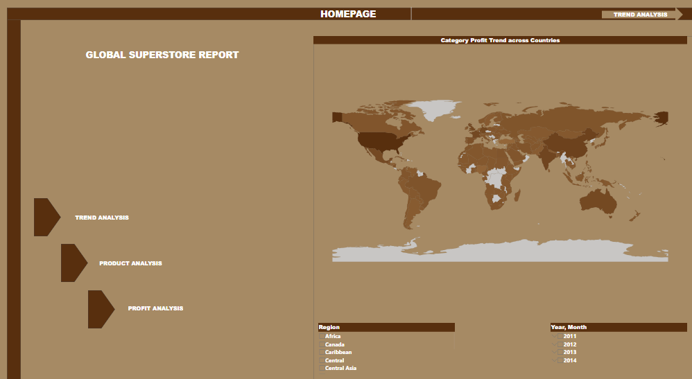
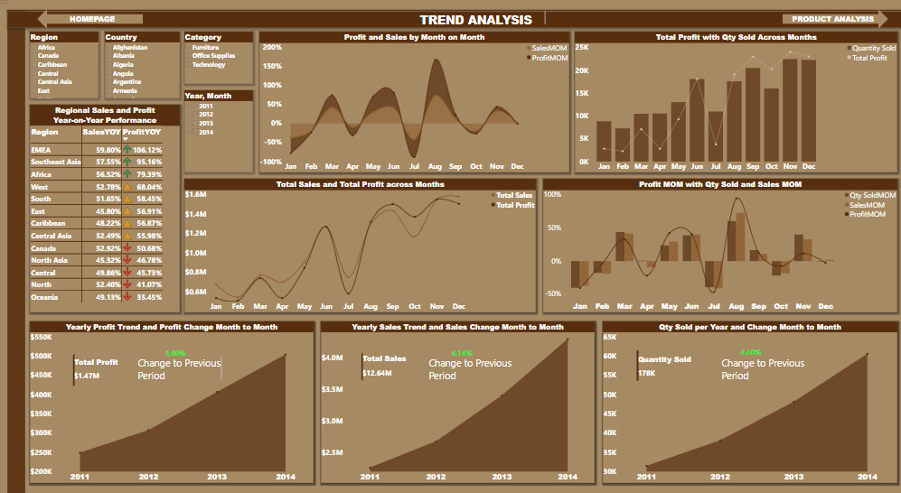
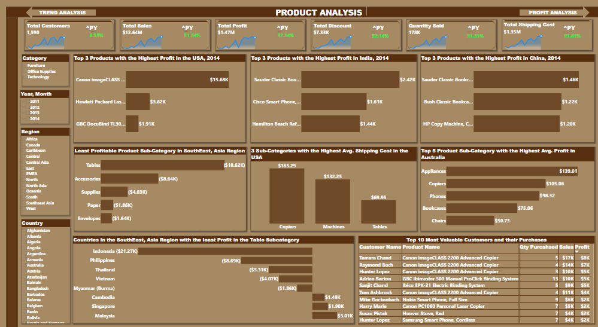
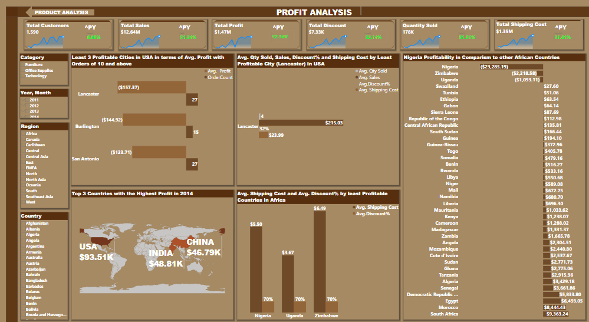

# Global Superstore Report

## Introduction:
This Power BI project represents the final milestone in my Digitaley Drive program. It explores product and profit performance for the fictional “Global Superstore,” an online retailer based in New York, USA. Global Superstore serves 147 countries with a diverse product catalog across three categories: Office Supplies, Furniture, and Technology.

_Disclaimer_: _The dataset is entirely fictional and bears no intentional resemblance to real-world entities._

## Business Objective: 
To optimize performance and improve profitability.

## Problem Statement:
1a: What are the three countries that generated the highest total profit for Global Superstore in 2014?

 b: For each of these three countries, find the three products with the highest total profit. Specifically, what are the products’ names and the total profit for each product?

2: Identify the 3 subcategories with the highest average shipping cost in the United States.

3a: Assess Nigeria’s profitability (i.e., total profit) for 2014. How does it compare to other African countries?  

b: What factors might be responsible for Nigeria’s poor performance? You might want to investigate shipping costs and the average discount as potential root causes.

4a: Identify the product subcategory that is the least profitable in Southeast Asia. Note: For this question, assume that Southeast Asia comprises Cambodia, Indonesia, Malaysia, Myanmar (Burma), the Philippines, Singapore, Thailand, and Vietnam.

b: Is there a specific country in Southeast Asia where Global Superstore should stop offering the subcategory identified in 4a?

5a: Which city is the least profitable (in terms of average profit) in the United States? For this analysis, discard the cities with less than 10 Orders.

b: Why is this city’s average profit so low?

6: Which product subcategory has the highest average profit in Australia?

7: Who are the most valuable customers and what do they purchase?

## Skills/Concept Demonstrated:
Key Power Bi features utilized include:

•	DAX,

•	Measures,

•	Tooltips,

•	Data Modelling,

•	Page Navigation,

•	Filters,

•	Interactive Buttons

## Data Sourcing:
Find the [link](https://docs.google.com/spreadsheets/d/1nxESpFzWjlGDMGDVLH69xmDzIl9l6OEq/edit#gid=633280281) to the dataset as provided by Digitaley Drive. This dataset was extracted from the web as an Excel file, and processed in Power BI. It includes: 

Web Extraction       |   Web Extraction into PBI  
:-------------------:|:--------------------------:
 | 

•	Orders Table: 51,290 rows, 24 columns

•	People Table: 1,000 rows, 2 columns

•	Returns Table: 1,174 rows, 3 columns

## Data Cleaning/Transformation
The extracted dataset was preprocessed in Power BI's Power Query Editor to ensure data quality, accuracy, and consistency. The following steps were applied:

1.	Error detection and validation confirmed that columns were error-free, with no duplicates, and accurate data types and formats.

2.	Six irrelevant columns (Ship Date, Ship Mode, Segment, Postal Code, Market, and Order Priority) were removed from the Orders table.
	
Deleted Columns1          |   Deleted Columns2        |  Deleted Columns3
:------------------------:|:-------------------------:|:----------------:
 |  |

3.	“United States” was replaced with the “United States of America” to align with the imported world map details.

United States Replaced    |  United States of America   
:------------------------:|:--------------------:
      |  

4.	DAX functions were utilized to create measures for tracking Key Performance Indicators (KPIs). Some of them include: :point_down:
   
  Total Customers         |  Total Profit        
:------------------------:|:--------------------:
  | 

5.	A calendar table was created for enhanced time-based analysis.
    

6.	Based on the project objective, only the Orders Table, transformed and renamed 'Analyzed Orders Data', was deemed relevant for analysis.

## Data Modelling:
 A star schema was implemented with the "Analyzed Orders Data" table as the fact table and the Calendar Table as a supporting dimension. Relationships were created between these tables to enable dynamic time-based filtering and insight.
 
 
## Analysis and Visualization: :flashlight: :bulb:
It features four pages highlighting trends, product performance, and profitability insights across four years.
You can interact with the report [here](https://app.powerbi.com/groups/me/reports/256c1e36-4388-4700-ad88-7b90c7756530?ctid=a24d3224-154f-4113-b5df-49523365c389&pbi_source=linkShare&bookmarkGuid=fcf2a992-8de5-4f11-84ae-9d608f0f4622)

### Homepage: :world_map: 
 
 Your navigation hub features interactive visuals and slicers, enabling users to analyze performance by region, year, or month, identify patterns, and drill into specific regions or periods for deeper insights.

- The Homepage features button links to the Trend Analysis, Product Analysis, and Profit Analysis pages. 

- The global map visual displays key metrics for 147 countries. When you hover over any country, Power BI Tooltips reveal detailed information, including total profit, total sales, total quantity sold, and a profit breakdown by three major product categories over the past four years.

- Region and Year/Month slicers enable dynamic filtering by region, year, or month, providing users with tailored views of the data.

### Trend Analysis: :chart_with_upwards_trend:
  
The Trend Analysis page provides detailed insights into sales, profit, and quantity trends over time, helping identify patterns and opportunities.

#### Regional Sales and Profit Year-on-Year Performance highlights:

- EMEA (106.12% profit, 59.80% sales), Southeast Asia (95.16% profit, 57.50% sales), and Africa (79.39% profit, 56.52% sales) as top performing regions with the highest profit growth

- West and South followed with moderate profit increases, while East, Caribbean, and Central Asia also showed stable upward trends.

- North and Oceania had the weakest performance, with Oceania reporting the lowest profit growth (35.45%) despite fair sales growth (49.13%).

#### Profit and Sales by Month-on-Month. Here: :point_down:

- August (94.51% profit, 72.65% sales), May (42.16% profit, 29.41% sales), and June (40.73% profit, 40.45% sales) led in profit growth. March also posted strong gains (32.64% profit, 41.70% sales).

- September and November also showed positive profit increases, while December had a slight dip in profit (-2.70%) despite a minor sales increase (1.90%).

- July had the steepest declines (-46.92% profit, -40.98% sales), with January, February, April, and October showing consistently negative profit trends.

#### Total Profit with Qty Sold Across Months:

- November ($175,450 profit, 22,494 qty sold), September ($170,438 profit, 20,542 qty sold), and December ($170,181 profit, 22,314 qty sold) led in profitability and quantities sold.

- August ($151,854 profit, 17,611 qty sold) and June ($147,079 profit, 18,119 qty sold) reflected strong profitability despite slightly lower quantities sold.

- January ($73,535 profit, 8,843 qty sold) and February ($70,932 profit, 7,281 qty sold) ranked lowest in profit and quantities sold.

#### Profit, Qty Sold and Sales Month-on-Month Performance:

- August (94.51% profit, 72.65% sales, 60.33% qty sold), May (42.16% profit, 29.41% sales, 23.60% qty sold), and June (40.73% profit, 40.45% sales, 38.93% qty sold) excelled in all metrics.

- March (32.64% profit, 41.70% sales, 43.95% qty sold) also performed notably.

- July recorded the steepest drops across all metrics (-46.92% profit, -40.98% sales, -39.38% qty sold), with January and October showing additional declines.

#### Total Sales and Total Profit Across Months:

- November ($175,450 profit, $1,551,277 sales), September ($170,438 profit, $1,437,380 sales), and December ($170,181 profit, $1,580,781 sales) ranked highest.

- October, August, and June showed consistent results in both metrics.

- January ($73,535 profit, $675,134 sales) and February ($70,932 profit, $543,739 sales) were the weakest months.

#### Yearly Profit, Sales, and Quantity Sold Trend and Month-on-Month Change:
:smile: Highlights annual profit trends, sales, quantities sold, and MOM changes over four years.

- All metrics showed steady growth over the four years, with the 2014 highest sales ($4,299,866), profit ($504,166), and quantities sold (60,622).

- Peak MOM growth is in August; sales (72.65%), profit (94.51%), and quantity sold (60.33%).

### Product Analysis: :bar_chart:

This section explores product performance, identifying top-performing items and optimization opportunities.

#### Question 1b: 
- The US market shows a strong preference for advanced office solutions, with the top 3 products being: Canon IMAGEclass 2200 Advanced Copier ($16.58k profit), Hewlett Packard Laserjet 3310 ($3.62k profit), GBC DocuBIND TL300 Electric Binding System ($1.91k profit)

- In India, the market is diverse, with a mix of smartphones and home office furniture. The top 3 products are: Sauder Classic Bookcase, Traditional ($2.42k profit), Cisco Smart Phone with Caller ID ($1.61k profit), Hamilton Beach Refrigerator, Red ($1.44k profit)

- China exhibits balanced demand for both copiers and bookcases, reflecting varied consumer preferences. The top 3 products are:
Bush Classic Bookcase, Metal ($1.46k profit), Sauder Classic Bush Classic Bookcase, Mobile ($1.22k profit), HP Copy Machine, Color ($1.19k profit)

#### Question 2:
- The top three sub-categories with the highest average shipping costs in the USA are Copiers ($165.29), Machines ($132.25), and Tables ($69.95).

- Heavier and larger products, such as copiers, incur higher costs due to factors like weight, dimensional weight, fuel surcharges, and additional handling.

#### Question 4a: 
The least profitable product subcategory in Southeast Asia is Tables, with a loss of (-$18.62k).
 
#### Question 4b: 
Global Superstore should consider discontinuing the Tables subcategory in Indonesia, as it incurred the highest loss of (-$10.68k). 
This significant loss suggests that the subcategory is underperforming in Indonesia. 

#### Question 6:
Appliances is the product sub-category with the highest average profit in Australia, at ($139.01).

#### Question 7: 
- Out of the top 10 most valuable customers, 5 purchased copiers (notably the Canon ImageCLASS 2200), 2 purchased binding systems, 2 purchased phones, and 1 purchased a red Hoover stove.

- Tamara Chand (profit $8.40k), Raymond Buch (profit $6.72k), and Adrian Barton (profit $5.04k) generated the highest profits, driven largely by purchases of the Canon ImageCLASS 2200.

- Susan Pistek, with a ( profit of $1.99k) purchased a red Hoover stove, and Hunter Lopez (profit of $1.99k) a Samsung smartphone, ranked lowest among the top 10 in terms of profit.

### Profit Analysis: :moneybag:

This page examines the store's profitability, highlighting profit trends, key drivers, and areas for improvement.

#### Question 1a: 
In 2014, USA generated ($93.51k profit), followed by India ($48.81k profit), then China ($46.79k profit).

#### Question 3a: 
- Nigeria experienced a substantial loss of (-$23.29k profit) in 2014, making it the least profitable among the 39 African countries analyzed. 
This starkly contrasts South Africa, which recorded the highest profit of $9.36k, outperforming Nigeria by 140.17%.

- Zimbabwe (-$2.22k profit) and Uganda (-$1.09k profit) reported significantly smaller losses compared to Nigeria.

- Nigeria accounted for -59.21% of the region's total profitability of $39.33k, underscoring its underperformance and significant negative impact on Africa's overall financial performance.

#### Question 3b: 
- Nigeria's loss in 2014 is mainly due to its high 70% discount rate, which significantly erodes revenue, and its average shipping cost of $5.50, higher than Uganda's ($3.67) but lower than Zimbabwe's ($6.49).

- Despite similar discounts, Uganda and Zimbabwe performed relatively better, highlighting Nigeria’s cost inefficiencies.

#### Question 5a:
Lancaster is the least profitable city in the United States, with an average profit of (-$157.37), Burlington (-$144.92), and San Antonio (-$123.71) also fall within the bottom three cities regarding average profitability.

#### Question 5b:
Lancaster’s average profit of -$157.37 is primarily driven by high discounts (32%) and elevated shipping costs ($23.99), which undermine the revenue generated from moderate sales volume ($215.03). 

### Recommendations:

1: Adjust discounts dynamically based on product type, customer segment, and regional performance; conduct market research in Nigeria to improve pricing strategies.

2: Negotiate better shipping rates for bulky or low-profit-margin items, establish regional warehouses in high-demand areas like Southeast Asia, and offer bundled shipping discounts for bulk orders.

3: Prioritize marketing for high-demand products like advanced copiers and leverage their demand to promote complementary items.

4: Reevaluate product offerings for underperforming Southeast Asian categories, especially tables in Indonesia, focusing on tailored marketing strategies and efficient resource allocation.

5: Launch loyalty programs and personalize customer engagement to retain valuable clients and encourage repeat purchases. Use advanced analytics to anticipate customer needs and optimize inventory planning.

### Conclusion:

This analysis underscores the importance of leveraging data-driven insights to address operational challenges and seize growth opportunities. While Global Superstore has achieved notable successes in regions and product categories, addressing inefficiencies in discounting and shipping costs can immediately enhance profit margins. Expanding focus on high-performing products while reassessing underperforming ones can streamline operations and inventory management.

The store can ensure sustained profitability and competitiveness by prioritizing tailored regional strategies, enhancing customer engagement through loyalty programs, and leveraging advanced analytics for future planning. The strategic execution of these recommendations will solidify Global Superstore’s position as a global market leader and reinforce its mission to be a one-stop shop for customers worldwide.

I truly appreciate your feedback and support! :sparkling_heart: :pray: :clap:

 

	

