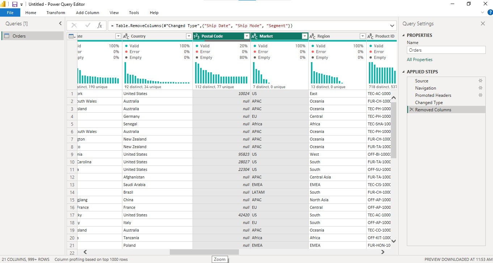

# Global Superstore Report

## Introduction: 
This Power BI project is the final milestone of my Digitaley Drive program. It dives into product and profit performance for a fictional company called "Global Superstore", an online retailer based in New York. The store serves customers in 147 countries and offers a wide range of products in three main categories: Office Supplies, Furniture, and Technology

_Disclaimer_: _This dataset is completely made up and is not based on any real people, places, or organizations._

## Business Objective: 
To optimize performance and improve profitability.

## Problem Statement:
1a: What are the three countries that generated the highest total profit for Global Superstore in 2014?

 b: For each of these three countries, find the three products with the highest total profit. Specifically, what are the products’ names and the total profit for each product?

2: Identify the 3 subcategories with the highest average shipping cost in the United States.

3a: Assess Nigeria’s profitability (i.e., total profit) for 2014. How does it compare to other African countries?  

b: What factors might be responsible for Nigeria’s poor performance? You might want to investigate shipping costs and the average discount as potential root causes.

4a: Identify the product subcategory that is the least profitable in Southeast Asia. Note: For this question, assume that Southeast Asia comprises Cambodia, Indonesia, Malaysia, Myanmar (Burma), the Philippines, Singapore, Thailand, and Vietnam.

b: Is there a specific country in Southeast Asia where Global Superstore should stop offering the subcategory identified in 4a?

5a: Which city is the least profitable (in terms of average profit) in the United States? For this analysis, discard the cities with less than 10 Orders.

b: Why is this city’s average profit so low?

6: Which product subcategory has the highest average profit in Australia?

7: Who are the most valuable customers and what do they purchase?

## Skills/Concept Demonstrated:
Key Power Bi features that were utilized include:

•	DAX,

•	Measures,

•	Tooltips,

•	Data Modelling,

•	Page Navigation,

•	Filters,

•	Interactive Buttons

## Data Sourcing:
You can find the [link](https://docs.google.com/spreadsheets/d/1nxESpFzWjlGDMGDVLH69xmDzIl9l6OEq/edit#gid=633280281) to the dataset provided by Digitaley Drive. This dataset was extracted from the web as an Excel file and processed in Power BI. It includes: 

Web Extraction       |   Web Extraction into PBI  
:-------------------:|:--------------------------:
 | 

•	Orders table: 51,290 rows, 24 columns

•	People table: 1,000 rows, 2 columns

•	Returns table: 1,174 rows, 3 columns

## Data Cleaning/Transformation:
The dataset was preprocessed using Power BI's Power Query Editor to ensure its quality, accuracy, and consistency. Here’s an overview of the steps taken:
1.	I performed checks to ensure that the columns were free from errors, with no duplicates, and data types and formats were correctly applied.

2.	To streamline the analysis, six unnecessary columns: Ship Date, Ship Mode, Segment, Postal Code, Market, and Order Priority, were removed from the Orders table.
	
Deleted Columns1          |   Deleted Columns2        |  Deleted Columns3
:------------------------:|:-------------------------:|:----------------:
 |  |

3.	“United States” was replaced with the “United States of America” to ensure consistency with the world map data imported into the report.

United States Replaced    |  United States of America   
:------------------------:|:--------------------:
      |  

4.	DAX functions were used to create measures that track key performance indicators (KPIs). Some of them include: :point_down:
   
  Total Customers         |  Total Profit        
:------------------------:|:--------------------:
  | 

5.	A calendar table was created to facilitate more efficient time-based analysis, ensuring that all time-related insights are accurate and easy to explore.
    

6.	Based on the project's objective, the Orders table was transformed and renamed to "Analyzed Orders Data", as it was the primary data source deemed relevant for analysis.

## Data Modelling:
 The data model follows a star schema, with the Analyzed Orders Data table serving as the fact table and the Calendar Table providing support as a dimension. By linking these tables, i created a structure that allows for seamless, dynamic time-based filtering, making it easy to discover insights across different time periods.
 
 
 
## Analysis and Visualization: :flashlight: :bulb:
This report consists of four pages that offer in-depth analysis across trends, product performance, and profitability insights spanning four years. Each page is designed to guide users through the data, highlighting key patterns and providing a comprehensive view of the business's performance.

You can explore the interactive report [here](https://app.powerbi.com/view?r=eyJrIjoiMTdjNGJmZjEtZmNhNy00YTg2LWJlZDQtZTA1M2M1OWI3N2NkIiwidCI6ImMwMTE3M2VkLTM2NWEtNGVmMS1iODMyLWNkNTkzYWJmMDU0ZSJ9&chromeless=true&navContentPaneEnabled=false)

### Homepage: :world_map: 
 
The homepage serves as the central hub for interactive data exploration in this report. It offers users a way to seamlessly analyze performance across regions, years, or months, helping them uncover patterns and dive deeper into specific areas.
 - Navigation links:
The homepage provides easy access to detailed sections, with quick links to the Trend Analysis, Product Analysis, and Profit Analysis pages. Each of these offers insights into different aspects of the data.
- Global map visual:
The dynamic global map lets you explore key metrics across 147 countries. Simply hover over any country to access detailed data via Power BI's tooltips, including total profit, sales, quantity sold, and a breakdown of profits by three key product categories, all tracked over the last four years.
- Interactive filters:
Region and Year/Month slicers let you filter the data based on your preferences. Whether you want to zoom in on a particular country or analyze trends by a specific timeframe, these slicers give you the flexibility to tailor your view of the data for deeper insights.

### Trend Analysis: :chart_with_upwards_trend:
  
This page breaks down how sales, profit, and quantities have changed over time, helping spot patterns and uncover new opportunities.

#### Regional Sales & Profit: Year-over-Year Performance:
The strongest year-on-year profit growth came from:
- EMEA - 106.12% profit and 59.80% sales, Southeast Asia - 95.16% profit and 57.50% sales, and Africa - 79.39% profit and 56.52% sales.
These regions clearly outperformed the rest, both in terms of profitability and sales momentum.

- Western and Southern regions also saw healthy gains, while Eastern, Caribbean, and Central Asia showed steady upward trends.
- On the other hand, North and Oceania lagged behind, with Oceania posting the weakest profit growth at 35.45%, despite a fair 49.13% bump in sales.

#### Month-on-Month Profit & Sales Trends. Here: :point_down:
The months that really stood out for profit growth were:
- August - 94.51% profit and 72.65% sales, May - 42.16% profit and  29.41% sales, and June - 40.73% profit and 40.45% sales.
March also showed strong performance with 32.64% profit and 41.70% sales.
- September and November stayed positive, while December dipped slightly in profit -2.70% despite a minor uptick in sales - 1.90%.
- The worst-performing month was July, which saw the steepest drop in both profit -46.92% and sales -40.98%. January, February, April, and October also had consistent losses in profit.

#### Total Profit & Quantity Sold by Month:
Top months by total profit and quantity sold were:
- November – $175,450 profit and 22,494 units, September – $170,438 profit and 20,542 units, and December – $170,181 profit and 22,314 units.
- August and June also performed well, with solid profit figures and slightly lower unit counts.

At the bottom:
- January – $73,535 profit and 8,843 units, and February – $70,932 profit and 7,281 units.

#### Month-on-Month Performance: Profit, Sales & Quantity:
Some months stood out across all three metrics:
- August - 94.51% profit, 72.65% sales, and 60.33% quantity, May - 42.16% profit, 29.41% sales, and 23.60% quantity, and June - 40.73% profit, 40.45% sales, and  38.93% quantity.
- March also delivered well-rounded growth: 32.64% profit, 41.70% sales, and 43.95% quantity sold.
- July saw the sharpest declines across the board, with -46.92% profit, -40.98% sales, and -39.38% quantity sold. January and October also showed weaker results.

#### Total Sales & Total Profit Across Months:
Leading months for both sales and profit:
- November – $175,450 profit and $1,551,277 sales, September – $170,438 profit and $1,437,380 sales, and December – $170,181 profit and $1,580,781 sales.
- October, August, and June also delivered strong and consistent numbers.
- Meanwhile, January - $73,535 profit and $675,134 sales,  and February - $70,932 profit and $543,739 sales had the lowest performance overall.

#### Yearly Trends & Month-on-Month Changes::smile: 
Over the span of four years, all key metrics: profit, sales, and quantity sold showed steady and healthy growth.
- 2014 marked the peak, with the highest overall sales - $4,299,866, profit - $504,166, and quantity sold - 60,622 units.

In terms of month-on-month momentum, August stood out again as the strongest across the board:
- Sales – 72.65%, Profit – 94.51%, and Quantity Sold – 60.33%.

### Product Analysis: :bar_chart:

This section looks into how different products are performing, identifying top-sellers and optimization opportunities.

#### Question 1b: 
In the U.S., there's a clear preference for advanced office equipment. The top three products were:
- Canon IMAGEclass 2200 Advanced Copier – $16.58k profit, Hewlett Packard LaserJet 3310 – $3.62k profit, and GBC DocuBIND TL300 Electric Binding System – $1.91k profit.

In India, the product mix is more varied, blending smartphones with home office furniture. Top performers were:
- Sauder Classic Bookcase, Traditional – $2.42k profit, Cisco Smart Phone with Caller ID – $1.61k profit,and Hamilton Beach Refrigerator, Red – $1.44k profit.

In China, demand is balanced across both copiers and bookcases, reflecting a diverse customer base. The top three products were:
- Bush Classic Bookcase, Metal – $1.46k profit, Sauder Classic Bush Classic Bookcase, Mobile – $1.22k profit, and HP Copy Machine, Color – $1.19k profit.

#### Question 2:
In the U.S., the sub-categories with the highest average shipping costs are:
- Copiers – $165.29, Machines – $132.25, and Tables – $69.95.
 
These costs are higher mostly because of the size and weight of the items, along with added charges like fuel surcharges and special handling fees.

#### Question 4a: 
In Southeast Asia, tables turned out to be the least profitable product sub-category, resulting in a total loss of -$18.62k.
 
#### Question 4b: 
Looking specifically at Indonesia, tables racked up the highest loss in the region at -$10.68k. Given the scale of the loss, Global Superstore should seriously consider phasing out or reworking its Table offerings in that market. Global Superstore should consider discontinuing the tables subcategory in Indonesia, as it incurred the highest loss of (-$10.68k). 

#### Question 6:
In Australia, Appliances lead in terms of profitability, with an average profit of $139.01 per item, the highest among all sub-categories there.

#### Question 7: 
Among the top 10 most valuable customers:
- 5 bought copiers—especially the Canon IMAGEclass 2200, 2 purchased binding systems, 2 went for phones, and 1 bought a red Hoover stove.

The top three contributors to profit were:
- Tamara Chand – $8.40k profit, Raymond Buch – $6.72k, and Adrian Barton – $5.04k. All three were mainly driven by purchases of the Canon ImageCLASS 2200.

At the lower end of the top 10:
- Susan Pistek earned $1.99k in profit from the Hoover stove. Hunter Lopez also brought in $1.99k, driven by a Samsung smartphone purchase.

### Profit Analysis: :moneybag:

This page explores how profitable the store was, spotlighting key trends, what’s driving performance, and where there’s room for improvement.

#### Question 1a: 
In 2014, the United States led the way with $93.51k in profit. India followed with $48.81k, and China came close behind at $46.79k. These three countries were the top performers globally that year.

#### Question 3a: 
- Nigeria faced a significant loss in 2014, with a negative profit of -$23.29k, making it the least profitable of the 39 African countries analyzed.
This stands in sharp contrast to South Africa, which led the continent with $9.36k in profit, outperforming Nigeria by 140.17%.
- Zimbabwe -$2.22k and Uganda -$1.09k also saw losses, but they were much smaller in comparison.
   
Overall, Nigeria accounted for -59.21% of the region’s total profit of $39.33k, showing just how much it dragged down Africa’s overall financial performance.

#### Question 3b:
So, what is  causing Nigeria’s poor performance?
Two key factors stand out:
- A steep 70% discount rate that’s heavily cutting into revenue.
- An average shipping cost of $5.50, which is higher than Uganda’s $3.67 but lower than Zimbabwe’s $6.49.

Despite all three countries having similarly high discounts, Nigeria still did worse suggesting deeper cost issues that go beyond pricing alone.

#### Question 5a: 
Looking at U.S. cities, Lancaster turned out to be the least profitable, with an average profit of -$157.37. Burlington -$144.92 and San Antonio -$123.71 also made the bottom three.

#### Question 5b:
Lancaster’s losses can be traced back to:
- A high 32% discount rate combined with expensive shipping cost averaging $23.99 made it difficult to turn a profit, especially given the modest sales volume of $215.03.

These combined factors made it tough for the city to turn a profit, despite a reasonable number of orders.

### Recommendations:

- Not all products or regions should get the same deals. It doesn’t make sense to treat everything equally when demand, margins, and customer behavior vary so much. Discounts should be tailored based on product type, customer segment, and where demand is strongest.  For example, conducting targeted market research in Nigeria could help fine-tune local pricing strategies and boost performance there. 
- It's also worth negotiating better rates for heavy or low-margin items since those tend to eat into profits quickly. Setting up warehouses in high-demand areas like Southeast Asia 
could help cut shipping costs and speed up delivery. And for bulk buyers, offering bundled shipping discounts might encourage larger orders.
- Some products, like advanced copiers are already in high demand. That momentum could be used to push related items or create smart bundles that offer more value to customers.
- On the flip side, some items like tables in Indonesia, aren’t doing well.  It might be time to revisit the marketing approach or even consider streamlining what’s offered in those regions.
 - Launching a rewards program and using customer data to personalize outreach can help keep your best customers loyal. At the same time, predictive analytics could make inventory planning much smarter and help you stay ahead of shifting demand.

### Conclusion:

This analysis shows just how powerful data can be, not just for spotting trends but for shaping smarter business moves. While Global Superstore is performing well in many areas, there’s still room to sharpen its strategy especially when it comes to pricing, shipping, and product focus.

By tailoring offers by region, doubling down on best-sellers, streamlining underperformers, and investing in customer loyalty, the company can take its performance to the next level. With the right mix of strategy and insight, Global Superstore is well-positioned to keep growing as a go-to global retailer.

I truly appreciate your feedback and support! :sparkling_heart: :pray: :clap:

 

	

